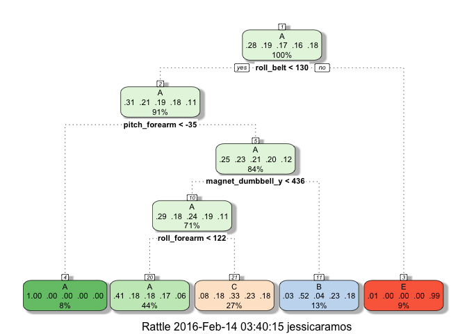

# Practical Machine Learning Course Project
Jessica Ramos  
February 11, 2016  

##Introduction

"Using devices such as Jawbone Up, Nike FuelBand, and Fitbit it is now possible to collect a large amount of data about personal activity relatively inexpensively. These type of devices are part of the quantified self movement – a group of enthusiasts who take measurements about themselves regularly to improve their health, to find patterns in their behavior, or because they are tech geeks. One thing that people regularly do is quantify how much of a particular activity they do, but they rarely quantify how well they do it."

Six young health participants were asked to perform one set of 10 repetitions of the Unilateral Dumbbell Biceps Curl in five different fashions: 

&nbsp;&nbsp;&nbsp;&nbsp;**Class A:** exactly according to the specification

&nbsp;&nbsp;&nbsp;&nbsp;**Class B:** throwing the elbows to the front

&nbsp;&nbsp;&nbsp;&nbsp;**Class C:** lifting the dumbbell only halfway

&nbsp;&nbsp;&nbsp;&nbsp;**Class D:** lowering the dumbbell only halfway

&nbsp;&nbsp;&nbsp;&nbsp;**Class E:** throwing the hips to the front

Class A corresponds to the specified execution of the exercise, while the other 4 classes correspond to common mistakes. Participants were supervised by an experienced weight lifter to make sure the execution complied to the manner they were supposed to simulate. The exercises were performed by six male participants aged between 20-28 years, with little weight lifting experience. We made sure that all participants could easily simulate the mistakes in a safe and controlled manner by using a relatively light dumbbell (1.25kg).

##Question
Using data from accelerometers on the belt, forearm, arm, and dumbell of the 6 participants, can we create a model to predict what way they performed the barbell lift (the classe variable containing A-E)?

##Data
The training data for this project are available here:
    https://d396qusza40orc.cloudfront.net/predmachlearn/pml-training.csv

The test data are available here:
    https://d396qusza40orc.cloudfront.net/predmachlearn/pml-testing.csv

First, we read in the training and testing datasets:

```r
#import datasets
trainData <- read.csv("https://d396qusza40orc.cloudfront.net/predmachlearn/pml-training.csv",
                      na.strings = c("#DIV/0!", "NA", ""))
testData <- read.csv("https://d396qusza40orc.cloudfront.net/predmachlearn/pml-testing.csv",
                     na.strings = c("#DIV/0!", "NA", ""))
```
We also load the packages that will be needed for the analysis:

```r
library(caret)
```

```
## Loading required package: lattice
```

```
## Loading required package: ggplot2
```

```r
library(rpart)
library(rpart.plot)
library(RColorBrewer)
library(rattle)
```

```
## Rattle: A free graphical interface for data mining with R.
## Version 4.1.0 Copyright (c) 2006-2015 Togaware Pty Ltd.
## Type 'rattle()' to shake, rattle, and roll your data.
```

```r
library(randomForest)
```

```
## randomForest 4.6-12
```

```
## Type rfNews() to see new features/changes/bug fixes.
```

```
## 
## Attaching package: 'randomForest'
```

```
## The following object is masked from 'package:ggplot2':
## 
##     margin
```
In looking at the columns of both the training and the test datasets, it appears that they contain the same variables except the test data set does not contain the classe variable (the variable we will be predicting) and contains a problem_id variable instead.

### Data Citation
Velloso, E.; Bulling, A.; Gellersen, H.; Ugulino, W.; Fuks, H. Qualitative Activity Recognition of Weight Lifting Exercises. Proceedings of 4th International Conference in Cooperation with SIGCHI (Augmented Human '13) . Stuttgart, Germany: ACM SIGCHI, 2013.

Read more: http://groupware.les.inf.puc-rio.br/har#wle_paper_section#ixzz3zvU7UUeS

##Features
After reading in the data, we need to do some preprocessing and data cleanup, ensuring we make the same changes to both the training and test datasets.

While evaluating missing data, I found that either the columns did not have any NAs present or they had more than 97% NA.  I dropped these columns that contained more than 97% missing data.  These variables are not valuable in making the predictions.  


```r
#only include columns from datasets where columns do not contain NAs
trainData <- trainData[, colSums(is.na(trainData)) == 0]
testData <- testData[, colSums(is.na(testData)) == 0]
```
We also take a look to see if any of the columns are of near zero variance.  These won't have a significant impact on the prediction model.

We see that the 6th column, new_window, has near zero variance and remove that from the dataset.

```r
nzv <- nearZeroVar(trainData)
trainData <- trainData[, -nzv]
testData <- testData[, -nzv]
```
We also remove some of the descriptive columns that don't add to the analysis (such as raw timestamps and user names).

```r
trainData <- trainData[, -c(1:5)]
testData <- testData[, -c(1:5)]
```
##Algorithm
To prevent overfitting, we split the training dataset into a training and validation test set, using 60% for training and 40% for cross validation.


```r
set.seed(1234) 
inTrain <- createDataPartition(trainData$classe, p = 0.6, list = FALSE)
train <- trainData[inTrain, ]
validate <- trainData[-inTrain, ]
```
##Develop Prediction Models

###Decision Tree Model
The first model I look at is a decision tree.


```r
##develop model
modelFit1 <- train(classe ~ ., data=train, method="rpart", trControl=trainControl(method = "cv"))
##show tree
fancyRpartPlot(modelFit1$finalModel)
```



```r
##fit model to the validation dataset
predictionsModFit1 <- predict(modelFit1, validate)
##look at confusion matrix to look at accuracy
confusionMatrix(predictionsModFit1, validate$classe)
```

```
## Confusion Matrix and Statistics
## 
##           Reference
## Prediction    A    B    C    D    E
##          A 2029  638  644  567  209
##          B   44  505   49  232  211
##          C  155  375  675  487  383
##          D    0    0    0    0    0
##          E    4    0    0    0  639
## 
## Overall Statistics
##                                           
##                Accuracy : 0.4904          
##                  95% CI : (0.4793, 0.5016)
##     No Information Rate : 0.2845          
##     P-Value [Acc > NIR] : < 2.2e-16       
##                                           
##                   Kappa : 0.3339          
##  Mcnemar's Test P-Value : NA              
## 
## Statistics by Class:
## 
##                      Class: A Class: B Class: C Class: D Class: E
## Sensitivity            0.9091  0.33267  0.49342   0.0000  0.44313
## Specificity            0.6334  0.91530  0.78388   1.0000  0.99938
## Pos Pred Value         0.4965  0.48511  0.32530      NaN  0.99378
## Neg Pred Value         0.9460  0.85114  0.87992   0.8361  0.88852
## Prevalence             0.2845  0.19347  0.17436   0.1639  0.18379
## Detection Rate         0.2586  0.06436  0.08603   0.0000  0.08144
## Detection Prevalence   0.5209  0.13268  0.26447   0.0000  0.08195
## Balanced Accuracy      0.7712  0.62399  0.63865   0.5000  0.72125
```
We can see from the confusion matrix that our accuracy is not very good with accuracy value being around 49%.  

##Random Forest
Next, I will try a random forest to see if that improves accuracy.


```r
##develop model
modelFit2 <- train(classe ~ ., data=train, method="rf", trControl=trainControl(method = "cv"))
##fit model to the validation dataset
predictionsModFit2 <- predict(modelFit2, validate)
##look at confusion matrix to look at accuracy
confusionMatrix(predictionsModFit2, validate$classe)
```

```
## Confusion Matrix and Statistics
## 
##           Reference
## Prediction    A    B    C    D    E
##          A 2232    4    0    0    0
##          B    0 1510    4    0    3
##          C    0    4 1363    7    0
##          D    0    0    1 1279    3
##          E    0    0    0    0 1436
## 
## Overall Statistics
##                                           
##                Accuracy : 0.9967          
##                  95% CI : (0.9951, 0.9978)
##     No Information Rate : 0.2845          
##     P-Value [Acc > NIR] : < 2.2e-16       
##                                           
##                   Kappa : 0.9958          
##  Mcnemar's Test P-Value : NA              
## 
## Statistics by Class:
## 
##                      Class: A Class: B Class: C Class: D Class: E
## Sensitivity            1.0000   0.9947   0.9963   0.9946   0.9958
## Specificity            0.9993   0.9989   0.9983   0.9994   1.0000
## Pos Pred Value         0.9982   0.9954   0.9920   0.9969   1.0000
## Neg Pred Value         1.0000   0.9987   0.9992   0.9989   0.9991
## Prevalence             0.2845   0.1935   0.1744   0.1639   0.1838
## Detection Rate         0.2845   0.1925   0.1737   0.1630   0.1830
## Detection Prevalence   0.2850   0.1933   0.1751   0.1635   0.1830
## Balanced Accuracy      0.9996   0.9968   0.9973   0.9970   0.9979
```

Looking at the confusion matrix for the random forest model, we see that accuracy has increased to .9971.  The out of sample error is 1-accuracy, which is .0029 meaning out of sample error is less than .3%.

##Final Prediction
I apply the random forest prediction model to the test data set.

```r
predictTest <- predict(modelFit2, testData[, -54])
predictTest
```

```
##  [1] B A B A A E D B A A B C B A E E A B B B
## Levels: A B C D E
```
##Conclusion
The random forest model provided the best prediction with highest accuracy.  Some tweaks should be made since it does take quite some time to train this model.
